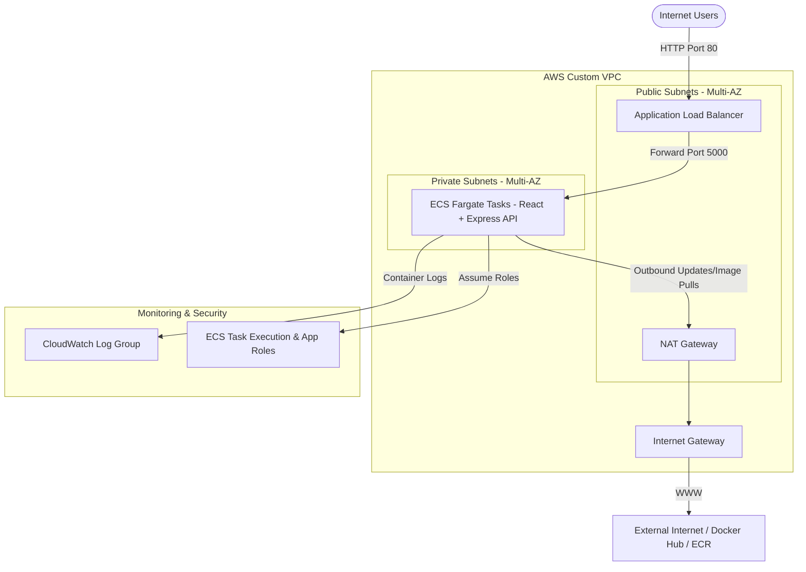

# ECS Application Hosting: React & Node.js on AWS Fargate via Terraform

A production-ready reference architecture and project boilerplate for hosting a secure, containerized full-stack application (React SPA + Express Node.js REST API) on AWS ECS using Fargate and managed through modularized Terraform IaC (Infrastructure as Code).

---

## Architecture Overview

The infrastructure deployed by Terraform follows AWS security and architectural best practices:

*   **Custom VPC**: Deploys a dedicated Virtual Private Cloud with public and private subnets mapped across multiple Availability Zones.
*   **Public/Private Separation**: 
    *   **Public Subnets**: Houses the Application Load Balancer (ALB) and NAT Gateway to handle inbound/outbound external communication.
    *   **Private Subnets**: Houses the ECS Fargate tasks. Tasks have no direct public IP, securing them from direct internet exposure. Outbound access (e.g., pulling images, connecting to APIs) is routed via the NAT Gateway.
*   **Application Load Balancer (ALB)**: Listens on HTTP port 80 and routes traffic to container tasks in the private subnet using an IP-based Target Group.
*   **ECS Fargate Service**: Deploys the container image into a managed ECS cluster. Autoscaling or desired task counts are maintained automatically.
*   **IAM Security**: Deploys decoupled roles:
    *   *Task Execution Role*: Used by the ECS agent to pull Docker images from registry providers and push runtime stdout/stderr logs to Amazon CloudWatch.
    *   *Task Role*: Used by the application inside the container to authorize integrations with AWS resources (e.g. Secrets Manager, SSM Parameter Store).

### Infrastructure Diagram



---

## Project Structure

```text
├── .github/
│   └── workflows/
│       ├── application.yml        # Build, test, and ECS deploy application pipeline
│       └── infrastructure.yml     # Format check, validate, and deploy infrastructure pipeline
├── app/
│   ├── backend/
│   │   ├── Dockerfile             # Production multi-stage backend container
│   │   ├── package.json
│   │   ├── server.js              # Express API & Frontend static hosting script
│   │   └── package-lock.json
│   └── frontend/
│       ├── Dockerfile             # Static server hosting (alternative deployment)
│       ├── package.json
│       ├── vite.config.ts         # Vite TypeScript project config
│       ├── src/
│       │   ├── App.tsx            # React Dashboard with CRUD & metrics UI
│       │   └── index.css          # Styled Vanilla CSS variables and glassmorphism UI
│       └── dist/                  # Output build assets directory (produced by vite build)
├── environments/
│   ├── production/                # Production environment configuration files
│   │   ├── backend.tf
│   │   ├── main.tf
│   │   ├── outputs.tf
│   │   ├── providers.tf
│   │   └── variables.tf
│   └── staging/                   # Staging environment configuration files
│       ├── backend.tf
│       ├── main.tf
│       ├── outputs.tf
│       ├── providers.tf
│       └── variables.tf
├── modules/
│   ├── alb/                       # ALB, Security Groups, Listeners, and Target Groups
│   ├── ecs/                       # ECS Cluster, Task Definition, Service, and CloudWatch Logs
│   ├── iam/                       # Execution and Task Role IAM policies
│   └── vpc/                       # VPC, Subnets, Route Tables, IGW, NAT, and Elastic IPs
├── backend-resources.tf           # Terraform resources needed to bootstrap S3 & DynamoDB backend
├── backend.tf                     # Remote state S3 backend definition
├── main.tf                        # Root Terraform configuration orchestrating modules
├── secrets.tf                     # Centralized AWS Secrets Manager secret definitions
├── variables.tf                   # Global input variables and configurations
├── outputs.tf                     # Root variables emitted from terraform runs
├── terraform.tfvars               # Deployment variable values overrides
└── README.md                      # This documentation
```

---

## Application Stack

The deployment targets a highly responsive, modern dashboard representing a system deployment checklist.

1.  **Frontend (React + Vite + TS)**:
    *   Connects dynamically to the backend API (`/api/health` and `/api/tasks`).
    *   Displays platform architecture, memory load, Node.js version, and container uptime.
    *   Includes an interactive checklist to add, complete, and delete deployment checklist tasks.
2.  **Backend (Express.js REST API)**:
    *   Provides health metrics and real-time server information using Node's `os` and `process` modules.
    *   Exposes endpoints: `/api/health` and `/api/tasks` (CRUD).
    *   Supports serving production React static bundle outputs transparently.

---

## Getting Started

### 1. Local Development (No AWS Needed)

To run the application locally on your machine for rapid iteration:

#### Start the Backend Server:
```bash
cd app/backend
npm install
npm start
```
*The Express server runs on [http://localhost:5000](http://localhost:5000) by default.*

#### Start the Frontend Server:
```bash
cd app/frontend
npm install
npm run dev
```
*The Vite dev server runs on [http://localhost:5173](http://localhost:5173). It is configured with a proxy targeting local port `5000` to prevent CORS issues.*

---

### 2. Running the Application via Docker

You can test the containerized system locally using Docker before pushing it to AWS.

#### Build the Backend Container:
```bash
cd app/backend
docker build -t ecs-app-backend .
```

#### Run the Backend Container:
```bash
docker run -p 5000:5000 ecs-app-backend
```
*Navigate to [http://localhost:5000](http://localhost:5000) in your browser to verify it starts and works correctly.*

---

## Deploying to AWS ECS with Terraform

### Prerequisites
*   [Terraform CLI](https://developer.hashicorp.com/terraform/downloads) installed.
*   [AWS CLI](https://aws.amazon.com/cli/) installed and configured with appropriate permissions (`aws configure`).
*   Your application Docker image built, tagged, and pushed to a registry accessible by your AWS account (e.g. AWS ECR or Docker Hub).

### Step-by-Step Deployment

1.  **Configure variables**:
    Update the values in [terraform.tfvars](file:///c:/Users/maits/Downloads/ECS%20IMPLEMENTATION/terraform.tfvars) to configure your AWS region, project naming, subnet definitions, and target Docker container image:
    ```hcl
    aws_region           = "us-east-1"
    environment          = "dev"
    app_name             = "ecs-modular"
    vpc_cidr             = "10.0.0.0/16"
    public_subnet_cidrs  = ["10.0.1.0/24", "10.0.2.0/24"]
    private_subnet_cidrs = ["10.0.10.0/24", "10.0.11.0/24"]
    container_image      = "your-registry-uri/ecs-app-backend:latest"
    container_port       = 5000
    container_cpu        = 256
    container_memory     = 512
    desired_count        = 2
    ```

2.  **Initialize Terraform**:
    Downloads backend providers and configures modules.
    ```bash
    terraform init
    ```

3.  **Generate Plan**:
    Verify the changes that will be introduced in your AWS infrastructure.
    ```bash
    terraform plan
    ```

4.  **Apply Infrastructure**:
    Deploy the resources to AWS.
    ```bash
    terraform apply
    ```
    *Review the plan output and type `yes` when prompted to authorize provisioning.*

5.  **Get ALB Endpoint**:
    Once the run completes, Terraform outputs the public address of your load balancer:
    ```bash
    Outputs:
    alb_dns_name = "ecs-modular-dev-alb-123456789.us-east-1.elb.amazonaws.com"
    ```
    *Access this URL in your browser to interact with the containerized application.*

---

## Destroying Resources
To teardown the provisioned resources and prevent ongoing AWS charges, execute:
```bash
terraform destroy
```
*Confirm with `yes` when prompted.*
